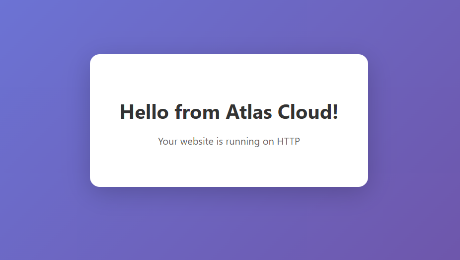

# VM Website Example

Deploy a website on Atlas Cloud with Terraform. Supports both HTTP (no domain) and HTTPS (with Let's Encrypt via Traefik).



## Quick Start

This example is **plug-and-play** - just add your credentials and SSH key!

```bash
# Copy example configuration
cp terraform.tfvars.example terraform.tfvars

# Edit with your credentials (only 3 required fields)
vim terraform.tfvars
```

**Required fields:**
- `cloudstack_api_key` - Your CloudStack API key
- `cloudstack_secret_key` - Your CloudStack secret key  
- `ssh_public_key` - Your SSH public key for VM access

```bash
# Deploy (takes ~2-3 minutes)
terraform init
terraform apply

# Get your website URL
terraform output website_url
```

That's it! Your website will be live with nginx serving a beautiful landing page.

## What Gets Deployed

The terraform configuration automatically:

1. ✅ Creates an isolated network with proper firewall rules
2. ✅ Deploys an Ubuntu 24.04 LTS VM
3. ✅ Installs nginx via cloud-init
4. ✅ Creates a beautiful landing page
5. ✅ Allocates a public IP with port forwarding (HTTP 80, SSH 22)
6. ✅ Configures ingress/egress firewall rules

**No manual installation required!**

### Example Configuration

```hcl
# CloudStack Configuration
cloudstack_api_url    = "https://sky.runatlas.is/client/api"
cloudstack_api_key    = "your-api-key"           # Get from sky.runatlas.is
cloudstack_secret_key = "your-secret-key"        # Get from sky.runatlas.is

# SSH Access
ssh_public_key = "ssh-rsa AAAA..."               # Your SSH public key

# That's all you need! The defaults below are already optimized for Atlas Cloud:
# - zone: "is1"
# - instance_service_offering: "Atlas.a4" (2 vCPU, 4GB RAM, 20GB disk)
# - network_offering: "DefaultIsolatedNetworkOfferingWithSourceNatService"

# HTTPS Configuration (optional - leave empty for HTTP-only)
domain_name   = ""  # e.g., "example.com"
email_address = ""  # e.g., "you@example.com" (required if domain_name is set)
```

## Configuration

**Minimal configuration** - You only need to provide:

1. **CloudStack API credentials** - Get from [sky.runatlas.is](https://sky.runatlas.is)
2. **SSH public key** - For VM access

**Optional configuration:**

- **HTTP-only** (default): Leave `domain_name` empty
- **HTTPS**: Set `domain_name` and `email_address`, then configure DNS

All infrastructure defaults are pre-configured for Atlas Cloud!

## DNS Setup (HTTPS only)

After deployment, point your domain's A record to the output IP:

```bash
terraform output webserver_public_ip
```

## Cleanup

```bash
terraform destroy
```

## Deployment Example

Successfully deployed example: **http://149.126.81.28/**

### What Gets Created

- **Network:** Isolated network with egress firewall rules (HTTP, HTTPS, DNS)
- **VM:** Ubuntu 24.04 LTS (2 vCPU, 4GB RAM, 20GB disk)
- **Web Server:** nginx automatically installed and configured via cloud-init
- **Landing Page:** Beautiful responsive HTML page
- **Public IP:** Static IP with port forwarding (HTTP 80, SSH 22)
- **Firewall:** Ingress rules for HTTP and SSH access

## Files

| File | Purpose |
|------|---------|
| `main.tf` | Infrastructure (network, VM, firewall) |
| `variables.tf` | Input variables |
| `cloud-init-http.yaml` | HTTP setup (nginx) |
| `cloud-init-https.yaml` | HTTPS setup (traefik + nginx) |
| `terraform.tfvars.example` | Example configuration |
| `FIREWALL_ISSUES.md` | Troubleshooting guide for CloudStack firewall issues |

## Troubleshooting

### Error 530: Failed to create firewall rule

**Symptom:** Terraform apply fails with error 530 when creating firewall rules.

**Cause:** CloudStack reuses public IPs that retain firewall rules from previous deployments.

**Solution:** This terraform configuration uses `managed = true` on firewall resources, which automatically handles cleanup. If issues persist, see [FIREWALL_ISSUES.md](./FIREWALL_ISSUES.md) for detailed troubleshooting steps.

### Error 530: Failed to delete network

**Symptom:** Terraform destroy fails to delete network with error 530.

**Cause:** CloudStack has a known bug/limitation preventing network deletion.

**Impact:** Networks accumulate but don't block new deployments (duplicate names allowed).

**Workaround:** Orphaned networks must be cleaned up by CloudStack administrators.

### Website not accessible from external IP

**Symptom:** `curl localhost` works on VM but external access times out.

**Cause:** Firewall rules not applied correctly or ingress rules missing.

**Solution:** 
1. Verify firewall rules exist: `terraform show | grep -A 20 cloudstack_firewall`
2. Check CloudStack UI for firewall rules on the public IP
3. See [FIREWALL_ISSUES.md](./FIREWALL_ISSUES.md) for detailed debugging

For comprehensive troubleshooting guide, see [FIREWALL_ISSUES.md](./FIREWALL_ISSUES.md).
